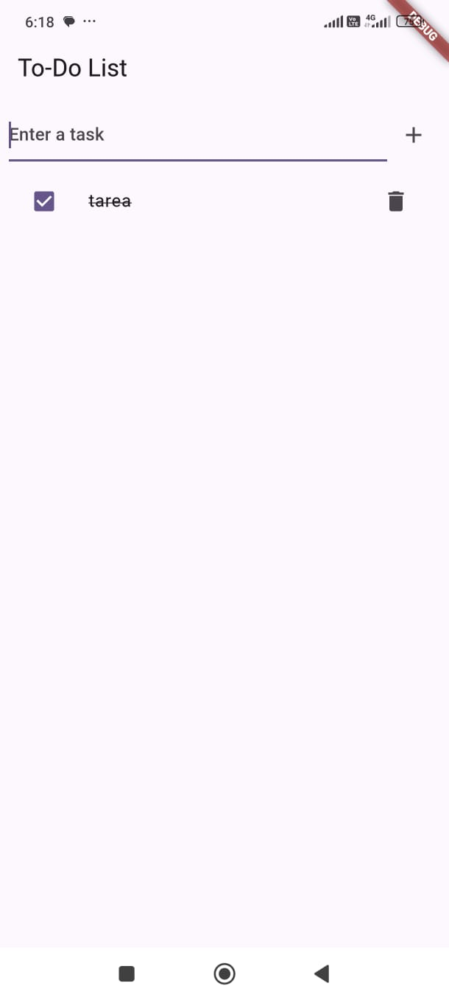
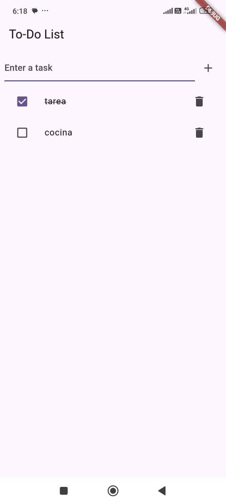

# Todo App

Una aplicación de Flutter para gestionar una lista de tareas (ToDo) utilizando `shared_preferences` para el almacenamiento local.

## Versión de Flutter 
Flutter 3.24.2 

## Características

- Añadir nuevas tareas
- Marcar tareas como completadas
- Eliminar tareas
- Persistencia de datos utilizando `shared_preferences`
- Uso de Provider para el control de estados.

## Capturas de Pantalla




## Instalación

1. Clona este repositorio:
    ```sh
    git clone https://github.com/tu_usuario/todo_app.git
    ```
2. Navega al directorio del proyecto:
    ```sh
    cd todo_app
    ```
3. Instala las dependencias:
    ```sh
    flutter pub get
    ```

## Uso

1. Ejecuta la aplicación:
    ```sh
    flutter run
    ```

2. Interactúa con la interfaz para añadir, completar o eliminar tareas.

## Estructura del Proyecto

- `lib/main.dart`: Punto de entrada de la aplicación.
- `lib/todo_provider.dart`: Proveedor de estado para gestionar la lista de tareas.
- `lib/todo.dart`: Modelo de datos para las tareas.

## Ejemplo de Código

### Modelo de Tarea (`Todo`)

```dart
class Todo {
  String title;
  bool isDone;

  Todo({
    required this.title,
    this.isDone = false,
  });

  Map<String, dynamic> toJson() {
    return {
      'title': title,
      'isDone': isDone,
    };
  }

  static Todo fromJson(Map<String, dynamic> json) {
    return Todo(
      title: json['title'],
      isDone: json['isDone'],
    );
  }
}
```

### Proveedor de Tareas (TodoProvider)

```dart
import 'dart:convert';
import 'package:flutter/material.dart';
import 'package:shared_preferences/shared_preferences.dart';
import 'todo.dart';

class TodoProvider with ChangeNotifier {
  List<Todo> _todos = [];

  List<Todo> get todos => _todos;

  void addTodo(Todo todo) {
    _todos.add(todo);
    notifyListeners();
    _saveToPrefs();
  }

  void toggleTodoStatus(int index) {
    _todos[index].isDone = !_todos[index].isDone;
    notifyListeners();
    _saveToPrefs();
  }

  void removeTodo(int index) {
    _todos.removeAt(index);
    notifyListeners();
    _saveToPrefs();
  }

  Future<void> _saveToPrefs() async {
    final prefs = await SharedPreferences.getInstance();
    prefs.setString('todos', jsonEncode(_todos.map((todo) => todo.toJson()).toList()));
  }

  Future<void> loadFromPrefs() async {
    final prefs = await SharedPreferences.getInstance();
    final todosString = prefs.getString('todos');
    if (todosString != null) {
      final List<dynamic> todosJson = jsonDecode(todosString);
      _todos = todosJson.map((json) => Todo.fromJson(json)).toList();
      notifyListeners();
    }
  }
}
```